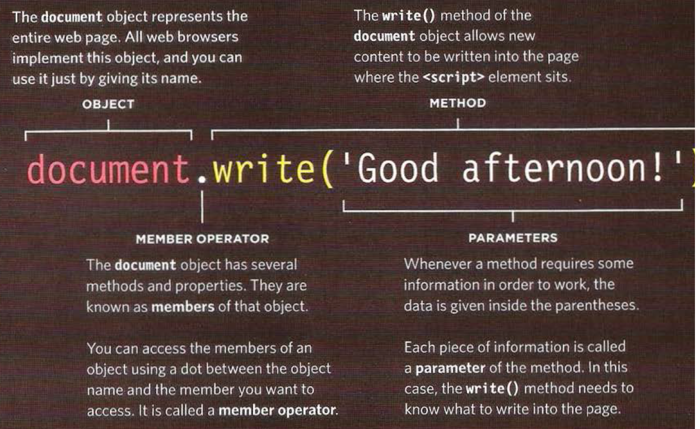

# How The web Works

When you enter a domain name in your browser you will send a request to the DNS which will look up for your domain name and send back an ip adress that will let your browser to connect to the web server that host the requsted domain and finaly send you the website.

# HTML & Tags & Elements

- HTML is only define the structure or the scelton and you your content which can be text, image, audio, and video
- every tag that will have a content will have tag and closing tag for example \
 \
 on other hand if it has no content within it doesn't has closing tag and some tags have atributes to give the element more informaion.

# main tags

\<html>
 
\<head>
 
\<title>This is the Title of the Page\</title>
 
\</head>
 
\<body>
 
\<h1>This is the Body of the Page\</h1>
 
\
Anything within the body of a web page is
displayed in the main browser window.\

 
\</body>
 
\</html>

- \<body> : all tags that display content shall be inside it
- \<head> : here you define your site information and embednt files.
- \<title> this will add a title at the tab.
- \<!-- --> comments : use it to give idea about what the current section or part of code is about and can used for document and make your code more informative for the others
- \
: used to group related content and give it a spicail fetures

* ID Attribute and Classes : they used to give your elements a identy but the id shall be unique and every element shall have only one id.

# Block & Inline

the block elements like h1 div p will always start a new line and will be affected by padding, width , margin. But the inline elements are the opisite and example of them are span, b, and i tags

# JS

By script we mean a small picie of code that of code that preform a task. So the computer can't do a task without following it step by step.
  
try to design a procure using steps or flowchart to help you writing your code.
  
Objects are represnt real world things and each object have:

- Properties: to describe the characteristics of your object.
- Evants: So the object get triggered at some events like a click.
- methods: used to interact with the object and describe what it can do.

# How Browser Sees A Web Page

- receive the sourse files.
- create a model for each html file and sub models called nodes.
- use rendering engine to show the page and if there no css file will apply a defalut styles. **_Every browser has its own defult styles_**

# The Mix Of HTML CSS JS

Every part have a pourpse and must separate each one from the other. And the JS code it is better to make several files.
 
to add JS we use \ and write the code between them or \ and add the path to the JS code.

## **_useful links:_**

- [Structure-web-pages-with-HTML](https://mohammad-eshtaiwi.github.io/reading-notes/Structure-web-pages-with-HTML)
- [Programming-with-JavaScript](https://mohammad-eshtaiwi.github.io/reading-notes/Programming-with-JavaScript)

* [Operators-and-Loops](https://mohammad-eshtaiwi.github.io/reading-notes/Operators-and-Loops)
